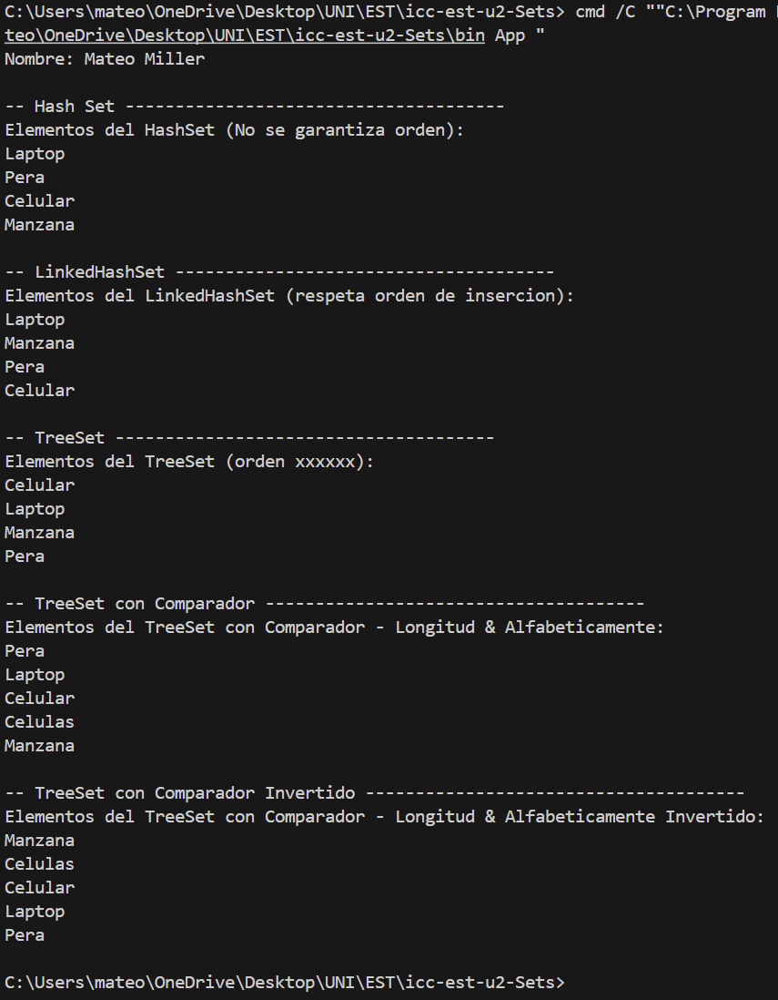

# Práctica de Uso de Colecciones Set en Java

## 📌 Información General

- **Título:** Práctica de Uso de HashSet, LinkedHashSet y TreeSet
- **Asignatura:** Estructura de Datos
- **Carrera:** Computación
- **Estudiante:** Miller Mendez Mateo Josue
- **Fecha:** 01 / 07 / 2025
- **Profesor:** Ing. Pablo Torres

---

## 🛠️ Descripción

Este proyecto en Java implementa y demuestra el funcionamiento de las principales colecciones `Set`:  
HashSet, LinkedHashSet y TreeSet, incluyendo el uso de comparadores personalizados.

A través de ejemplos prácticos, se muestran las diferencias en el manejo del orden y la unicidad de los elementos para cada tipo de Set.

Incluye:

- 🔗 **HashSet:** Almacena elementos únicos sin garantizar orden.
- 🔗 **LinkedHashSet:** Almacena elementos únicos respetando el orden de inserción.
- 🔗 **TreeSet:** Almacena elementos únicos de forma ordenada (natural o personalizada con Comparator).
- 🔗 **Comparadores personalizados:** Se muestran ejemplos de orden por longitud y orden invertido.

---

## 🧪 Estructura

- `controllers/Sets.java`: Clase principal con métodos para construir y mostrar ejemplos de HashSet, LinkedHashSet y TreeSet (con y sin Comparator).
- `App.java`: Punto de entrada que ejecuta los ejemplos y muestra resultados en consola.

---

## 🚀 Ejecución

Para ejecutar el proyecto:

1. Compila el código:
    ```bash
    javac App.java
    ```
2. Ejecuta la aplicación:
    ```bash
    java App
    ```

---

## 🧑‍💻 Ejemplo de Salida

```
Nombre: Mateo Miller

-- Hash Set --------------------------------------
Elementos del HashSet (No se garantiza orden): 
Laptop
Pera
Celular
Manzana

-- LinkedHashSet --------------------------------------
Elementos del LinkedHashSet (respeta orden de insercion):
Laptop
Manzana
Pera
Celular

-- TreeSet --------------------------------------
Elementos del TreeSet (orden alfabetico):
Celular
Laptop
Manzana
Pera

-- TreeSet con Comparador --------------------------------------
Elementos del TreeSet con Comparador - Longitud & Alfabeticamente:
Pera
Laptop
Celular
Celulas
Manzana

-- TreeSet con Comparador Invertido --------------------------------------
Elementos del TreeSet con Comparador - Longitud & Alfabeticamente Invertido:
Manzana
Celulas
Celular
Laptop
Pera
```

---

## 🧑‍💻 Ejemplo de Salida Visual


